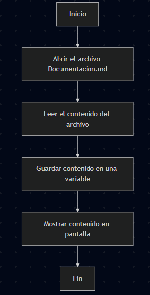

 # Tienda Aurelion — Documentación (sugerencias)

 ## Resumen ejecutivo

 Tienda Aurelion es un proyecto para centralizar la gestión de clientes, productos y ventas que actualmente están en hojas de Excel. La propuesta es migrar a una base de datos relacional normalizada para eliminar duplicidades, mejorar la consistencia y facilitar consultas y análisis.

 ## Tabla de contenidos

 - Resumen ejecutivo
 - Objetivo
 - Problema
 - Solución propuesta
 - Estructura de la base de datos (resumen)
 - Campos esenciales por tabla
 - Pasos para replicar / ejecutar análisis (usar archivos en `BD/`)
 - Respuestas y guía para las 15 preguntas de análisis
 - Buenas prácticas y recomendaciones

 ## Objetivo

 Centralizar y normalizar los datos de la Tienda Aurelion para mejorar la calidad de la información y facilitar consultas analíticas.

 ## Problema

 Actualmente los datos están distribuidos en múltiples hojas de Excel con columnas repetidas. Esto causa:

 - Duplicidad de registros
 - Dificultad para buscar y relacionar información
 - Mayor probabilidad de errores al actualizar datos

 ## Solución propuesta

 - Diseñar una base de datos relacional con tablas normalizadas: `categorias`, `ciudades`, `clientes`, `productos`, `medios_pago`, `ventas`, `detalle_ventas`.
 - Migrar los datos desde los archivos Excel en `BD/` a la base de datos.
 - Crear scripts en Python para análisis y reporte (ej. top productos, ingresos por cliente, tendencias mensuales).

 ## Estructura de la base de datos (resumen)

 Tablas principales y campos esenciales:

 - categorias: `id_categoria (PK)`, `nombre` 
 - ciudades: `id_ciudad (PK)`, `nombre` 
 - clientes: `id_cliente (PK)`, `nombre`, `email`, `fecha_alta`, `id_ciudad (FK)`
 - productos: `id_producto (PK)`, `nombre`, `precio_unitario`, `id_categoria (FK)`
 - medios_pago: `id_medio_pago (PK)`, `nombre`
 - ventas: `id_venta (PK)`, `fecha`, `id_cliente (FK)`, `id_medio_pago (FK)`
 - detalle_ventas: `id_detalle` (PK), `id_venta (FK)`, `id_producto (FK)`, `cantidad`, `importe`

 ### Notas sobre tipos
 - Usar tipos fecha para campos de fecha.
 - Usar numéricos (DECIMAL) para precios e importes para evitar problemas de redondeo.

 ## Pasos para análisis (con archivos en `BD/`)

 1. Instalar dependencias: `pandas`, `openpyxl`, `sqlalchemy` (opcional para BD).
 2. Cargar cada archivo Excel desde `BD/` en DataFrames.
 3. Limpiar y normalizar columnas (unificar nombres, eliminar duplicados, cast de tipos).
 4. Insertar en la base de datos o ejecutar análisis directamente en pandas.

 ## Guía rápida para las 15 preguntas

 1. Tipo de información que se repite: campos de cliente (nombre, email), producto (nombre, precio), y detalles de venta (fecha, cantidad, importe).
 2. Problema principal: duplicidad y dispersión de datos en Excel; dificulta consultas y aumenta errores.
 3. 10 productos más vendidos: (se obtiene al sumar `cantidad` por `id_producto` en `detalle_ventas`).
 4. 10 productos que generan más ingresos: (se obtiene al sumar `importe` por `id_producto`).
 5. Top 20 clientes por ingresos: (sumar `importe` por `id_cliente` uniendo `ventas` con `detalle_ventas`).
 6. Mejora en tiempo de búsqueda: con índices en campos clave (`id_cliente`, `id_producto`, `fecha`) y consultas SQL optimizadas se reduce drásticamente el tiempo de respuesta.
 7. Compra media por cliente: (total ingresos / número de clientes con compras).
 8. Pedidos totales: contar filas únicas en `ventas`.
 9. Valor promedio por pedido: (total ingresos / número de pedidos).
 10. Campos esenciales: los listados en la sección "Estructura de la base de datos".
 11. Identificar clientes VIP: agregar una tabla o campo `tipo_cliente` y calcular frecuencia/importe para marcar VIPs; también usar reglas (ej. top 5% por frecuencia o por suma de gasto).
 12. Método de pago más utilizado: contar `ventas.id_medio_pago` y ordenar por frecuencia.
 13. Ciudad con más ventas: agrupar `clientes.id_ciudad` o `ventas` por ciudad y sumar cantidad/importe.
 14. Ingreso total: sumar `importe` en `detalle_ventas`.
 15. Tendencia mensual: agregar `importe` por mes (usar `ventas.fecha` y agrupar por YYYY-MM).

 ## Buenas prácticas

 - Mantener un diccionario de datos (data dictionary) que describa cada columna.
 - Validar y limpiar datos antes de migrar.
 - Guardar backups de los archivos originales.
 - Usar transacciones al insertar en la BD para evitar datos parcialmente escritos.

 ## Siguientes pasos recomendados

 - Si quieres, puedo generar los scripts en Python para:
   - Cargar y limpiar los Excel desde `BD/`.
   - Calcular los KPIs (top productos, top clientes, total ingresos, tendencia mensual).
   - Crear un esquema SQL para la BD y un script de migración.

 ---

 Documento generado por Copilot — sugerencias para mejorar la documentación original.
# Proyecto - Tienda Aurelion

# Tema

Administrar y organizar a los clientes, productos y ventas de la Tienda Aurelion. 

# Problema

Actualmente, la Tienda Aurelion registra sus datos en archivos de Excel, donde se observa que en varias 
hojas se repiten las mismas columnas. Esto provoca duplicidad de información, dificultades en la búsqueda 
de datos y un mayor riesgo de errores en los registros.

# Solución

Implementar una base de datos relacional que organice la información en diferentes tablas normalizadas,
evitando columnas duplicadas. De esta manera, se garantiza que la información sea más accesible, 
consistente y fácil de consultar.

# Equipo
    - nombre de equipo
        - Grupo 4 - Deep learning Team
    - cantidad de integrantes 
        - 8
# Base de datos
- BASES DE DATOSSSSSSSSSSSSSSSSSSSSSSSSSSS
## Fuente

- Secundaria porque fueron recolectados por otra persona o fuente externa.

## Estructura

- Datos estructurados porque la mayoria de los datos estan organizandos en tablas.

### Tablas:
- Categoría
- ventas
- Medio de Pago
- productos
- detalle_ventas
- clientes
- ciudad

### Tipos y Escala

- Categoría

| Columnas | Tipos de datos | Escala     |
| :--- | :---: | ---: |
| Id_categoría | Cualitativo | Nominal |
| categoría | Cualitativo | Nominal |

- Ciudad

| Columnas | Tipos de datos | Escala     |
| :--- | :---: | ---: |
| Id_ciudad | Cualitativo | Nominal |
| ciudad | Cualitativo | Nominal |

- Clientes

| Columnas | Tipos de datos | Escala     |
| :--- | :---: | ---: |
| Id_cliente | Cualitativo | Nominal |
| nombre_cliente | Cualitativo | Nominal |
| Email | Cualitativo | Nominal |
| Fecha_alta | Fecha | Intervalo |
| id_ciudad | Cualitativo | Nominal |

- Producto
  
| Columnas | Tipos de datos | Escala     |
| :--- | :---: | ---: |
| Id_producto | Cualitativo | Nominal |
| nombre_producto | Cualitativo | Nominal |
| precio_unitario | Cuantitativo | Razón |
| Id_categoria | Cualitativo | Nominal |

- Medio de Pago

| Columnas | Tipos de datos | Escala     |
| :--- | :---: | ---: |
| Id_medio_pago | Cualitativo | Nominal |
| medio_pago | Cualitativo | Nominal |

- Venta

| Columnas | Tipos de datos | Escala     |
| :--- | :---: | ---: |
| Id_venta | Cualitativo | Nominal |
| Fecha | Fecha | Intervalo |
| Id_cliente | Cualitativo | Nominal |
| Id_medio_pago | Cualitativo | Nominal |

- Detalle Ventas

| Columnas | Tipos de datos | Escala     |
| :--- | :---: | ---: |
| Id_venta | Cualitativo | Nominal |
| Id_producto | Cualitativo | Nominal |
| Cantidad | Cuantitativo | Razón |
| Importe | Cuantitativo | Razón |

### Clave primaria (Primary Key - PK): Campos que garantizan la unicidad de cada registro
    
    id_categoria, id_ciudad, id_cliente, id_venta, id_producto, id_medio_pago

### Clave foránea (Foreign Key - FK): Campo que establece una relación lógica con la clave primaria

- Un cliente pertenece a una ciudad (`clientes.id_ciudad → ciudad.id_ciudad`).
- Un producto pertenece a una categoría (`productos.id_categoria → categoria.id_categoria`).
- Una venta la realiza un cliente (`ventas.id_cliente → clientes.id_cliente`).
- Una venta se paga con un medio de pago (`ventas.id_medio_pago → medio_pago.id_medio_pago`).
- Un detalle de venta pertenece a una venta (`detalle_ventas.id_venta → ventas.id_venta`).
- Un detalle de venta corresponde a un producto (`detalle_ventas.id_producto → productos.id_producto`).

# Programa en Python que consultará la documentación.

## Información:
    
    - tema elegido
        - Tienda aurelion
        
   

## Pasos:

    - Abrir el archivo Documentación.md
    - Leer el contenido del archivo.
    - Guardar el contenido en una variable.
    - Imprimir el contenido en pantalla.

## Pseudocódigo:

    Inicio
        Abrir el archivo Documentación.md
        Leer el contenido del archivo.
        Guardar contenido en una variable.
        Mostrar contenido en pantalla.
    Fin

## Diagrama de flujo:
flowchart TD
    A[Inicio] --> B[Abrir el archivo Documentación.md]
    B --> C[Leer el contenido del archivo]
    C --> D[Guardar contenido en una variable]
    D --> E[Mostrar contenido en pantalla]
    E --> F[Fin]

## Preguntas

- 15 preguntas acerca de 

1. Que tipo de información se repeto con mayor frecuencia entre los datos en los archivos o hoja de Excel?
2. ¿Cuál es el principal problema que el proyecto busca solucionar para la Tienda Aurelion?
3. ¿Cuáles son los 10 productos más vendidos en cantidad?
4. ¿Qué 10 productos generan más ingresos?
5. ¿Quiénes son los 20 clientes que más compran en términos de ingresos?
6. Como se espera que con la nueva organización o gestión de la información el tiempo de busqueda mejore?
7. ¿Cuál es la compra media por cliente?
8. ¿Cuántos pedidos totales se han realizado?
9. ¿Cuál es el valor promedio por pedido?
10. Que campos o columnas se consideran esenciales en la BD?
11. ¿Cómo modificar la estructura actual para identificar a los "clientes VIP" (los que compran con más frecuencia) y ofrecerles descuentos especiales?
12. Cual es el metodo de pago que mas se utiliza ? 
13. Cual es el barrio o ciudad que tiene mas ventas ?
14. ¿Cuál es el ingreso total generado por el negocio?
15. ¿Cómo ha sido la tendencia de ingresos mensuales?