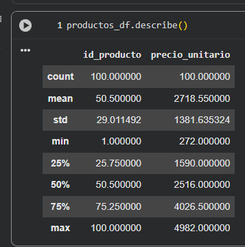

# Proyecto - Tienda Aurelion
---
# Tema

Administrar y organizar a los clientes, productos y ventas de la Tienda Aurelion. 

# Problema

Actualmente, la Tienda Aurelion registra sus datos en archivos de Excel, donde se observa que en varias 
hojas se repiten las mismas columnas. Esto provoca duplicidad de información, dificultades en la búsqueda 
de datos y un mayor riesgo de errores en los registros.

# Solución

Implementar una base de datos relacional que organice la información en diferentes tablas normalizadas,
evitando columnas duplicadas. De esta manera, se garantiza que la información sea más accesible, 
consistente y fácil de consultar.

# Equipo
- nombre de equipo
    - Grupo 4 - Deep learning Team
- cantidad de integrantes 
    - 8

---
# Base de datos

## Fuente

- Secundaria porque fueron recolectados por otra persona o fuente externa.

## Estructura

- Datos estructurados porque la mayoria de los datos estan organizandos en tablas.

## Tablas:
- Categoría
- Ventas
- Medio de Pago
- Productos
- Detalle_ventas
- clientes
- ciudad

## Tipos y Escala

- Categoría

| Columnas | Tipos de datos | Escala     |
| :--- | :---: | ---: |
| Id_categoría | Cualitativo | Nominal |
| categoría | Cualitativo | Nominal |

- Ciudad

| Columnas | Tipos de datos | Escala     |
| :--- | :---: | ---: |
| Id_ciudad | Cualitativo | Nominal |
| ciudad | Cualitativo | Nominal |

- Clientes

| Columnas | Tipos de datos | Escala     |
| :--- | :---: | ---: |
| Id_cliente | Cualitativo | Nominal |
| nombre_cliente | Cualitativo | Nominal |
| Email | Cualitativo | Nominal |
| Fecha_alta | Fecha | Intervalo |
| id_ciudad | Cualitativo | Nominal |

- Producto
  
| Columnas | Tipos de datos | Escala     |
| :--- | :---: | ---: |
| Id_producto | Cualitativo | Nominal |
| nombre_producto | Cualitativo | Nominal |
| precio_unitario | Cuantitativo | Razón |
| Id_categoria | Cualitativo | Nominal |

- Medio de Pago

| Columnas | Tipos de datos | Escala     |
| :--- | :---: | ---: |
| Id_medio_pago | Cualitativo | Nominal |
| medio_pago | Cualitativo | Nominal |

- Venta

| Columnas | Tipos de datos | Escala     |
| :--- | :---: | ---: |
| Id_venta | Cualitativo | Nominal |
| Fecha | Fecha | Intervalo |
| Id_cliente | Cualitativo | Nominal |
| Id_medio_pago | Cualitativo | Nominal |

- Detalle Ventas

| Columnas | Tipos de datos | Escala     |
| :--- | :---: | ---: |
| Id_venta | Cualitativo | Nominal |
| Id_producto | Cualitativo | Nominal |
| Cantidad | Cuantitativo | Razón |
| Importe | Cuantitativo | Razón |

### Clave primaria (Primary Key - PK): Campos que garantizan la unicidad de cada registro
    
    id_categoria, id_ciudad, id_cliente, id_venta, id_producto, id_medio_pago

### Clave foránea (Foreign Key - FK): Campo que establece una relación lógica con la clave primaria

- Un cliente pertenece a una ciudad (`clientes.id_ciudad → ciudad.id_ciudad`).
- Un producto pertenece a una categoría (`productos.id_categoria → categoria.id_categoria`).
- Una venta la realiza un cliente (`ventas.id_cliente → clientes.id_cliente`).
- Una venta se paga con un medio de pago (`ventas.id_medio_pago → medio_pago.id_medio_pago`).
- Un detalle de venta pertenece a una venta (`detalle_ventas.id_venta → ventas.id_venta`).
- Un detalle de venta corresponde a un producto (`detalle_ventas.id_producto → productos.id_producto`).

---

# Programa en Python que consultará la documentación.

## Información:
    
- Tema elegido
    - Tienda aurelion
        
   

## Pasos:

- Abrir el archivo Documentación.md
- Leer el contenido del archivo Documentación.md
- Extraer las secciones del markdown basados en los headers de nivel1
- Mostrar el menu con las secciones que se quieren seleccionar del archivo documentacion.md
- Guardar en una variable la opcion de la seccion
- Realizar la validacion de la opcion seleccionada
- Mostrar el contenido de la seccion en pantalla

## Pseudocódigo:

    INICIO

        ABRIR archivo "Documentación.md"
        LEER todo el contenido del archivo
        EXTRAER las secciones basadas en los encabezados de nivel 1 ("#")
        
        MOSTRAR menú con los títulos de las secciones encontradas
        PEDIR al usuario que seleccione una opción
        GUARDAR la opción seleccionada en variable OPCION

        SI OPCION es válida ENTONCES
            OBTENER el contenido de la sección correspondiente
            MOSTRAR el contenido en pantalla
        SINO
            MOSTRAR "Opción inválida, por favor seleccione nuevamente"
        FIN SI

    FIN

## Diagrama de flujo:

## Preguntas

- 15 preguntas acerca de 

1. Que tipo de información se repite con mayor frecuencia entre los datos en los archivos o hoja de Excel?
2. ¿Cuál es el principal problema que el proyecto busca solucionar para la Tienda Aurelion?
3. ¿Cuáles son los 10 productos más vendidos en cantidad?
4. ¿Qué 10 productos generan más ingresos?
5. ¿Quiénes son los 20 clientes que más compran en términos de ingresos?
6. Como se espera que con la nueva organización o gestión de la información el tiempo de busqueda mejore?
7. ¿Cuál es la compra media por cliente?
8. ¿Cuántos pedidos totales se han realizado?
9. ¿Cuál es el valor promedio por pedido?
10. Que campos o columnas se consideran esenciales en la BD?
11. ¿Cómo modificar la estructura actual para identificar a los "clientes VIP" (los que compran con más frecuencia) y ofrecerles descuentos especiales?
12. Cual es el metodo de pago que mas se utiliza ? 
13. Cual es el barrio o ciudad que tiene mas ventas ?
14. ¿Cuál es el ingreso total generado por el negocio?
15. ¿Cómo ha sido la tendencia de ingresos mensuales?