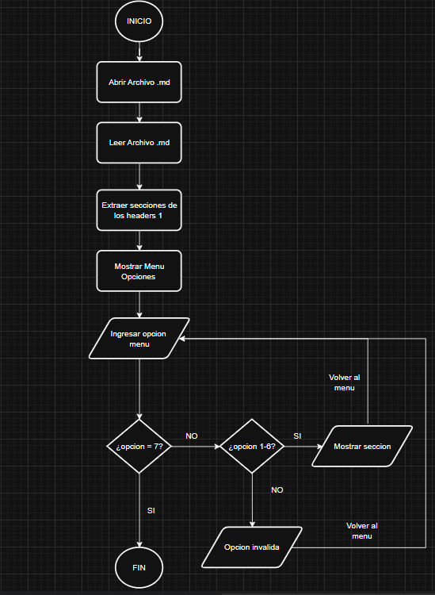
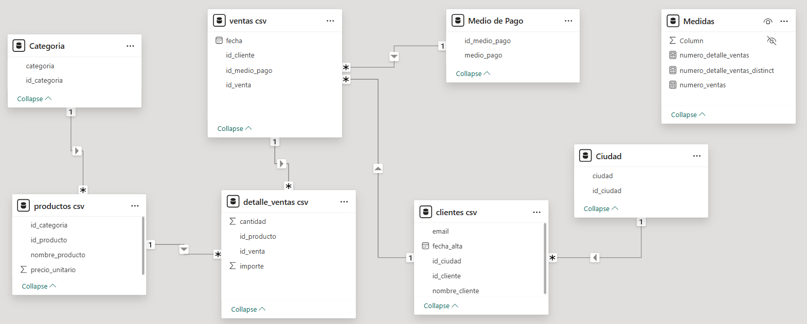

# Proyecto - Tienda Aurelion
---
---
# Tema

Administrar y organizar a los clientes, productos y ventas de la Tienda Aurelion. 

# Problema

Actualmente, la Tienda Aurelion registra sus datos en archivos de Excel, donde se observa que en varias 
hojas se repiten las mismas columnas. Esto provoca duplicidad de información, dificultades en la búsqueda 
de datos y un mayor riesgo de errores en los registros. - 

# Solución

Organizar y estandarizar toda la información de la tienda en una estructura más clara y coherente en una base de datos relacional, evitando duplicaciones y permitiendo analizar los datos de forma precisa. Esto facilita la generación de reportes, la identificación de patrones y la obtención de métricas útiles, lo que le permitirá al dueño tomar decisiones más rápidas, informadas y basadas en evidencia.

<!-- - Crear una arquitectura que posibilite al dueño de la tienda a tomar mejores decisiones, mejores visualizaciones  -->

# Equipo
- nombre de equipo
    - Grupo 4 - Deep learning Team
- cantidad de integrantes 
    - Marcio Mallqui
    - Andrey Gomez
    - Karen Martin

---
# Base de datos

## Fuente

- Secundaria porque fueron recolectados por otra persona o fuente externa.

## Estructura

- Datos estructurados porque la mayoria de los datos estan organizandos en tablas.

## Tablas:
- Categoría
- Ventas
- Medio de Pago
- Productos
- Detalle_ventas
- clientes
- ciudad

## Tipos y Escala

- Categoría

| Columnas | Tipos de datos | Escala     |
| :--- | :---: | ---: |
| Id_categoría | Cuantitativo | Razón |
| categoría | Cualitativo | Nominal |

- Ciudad

| Columnas | Tipos de datos | Escala     |
| :--- | :---: | ---: |
| Id_ciudad | Cuantitativo | Razón |
| ciudad | Cualitativo | Nominal |

- Clientes

| Columnas | Tipos de datos | Escala     |
| :--- | :---: | ---: |
| Id_cliente | Cuantitativo | Razón |
| nombre_cliente | Cualitativo | Nominal |
| Email | Cualitativo | Nominal |
| Fecha_alta | Fecha | Intervalo |
| id_ciudad | Cuantitativo | Razón |

- Producto
  
| Columnas | Tipos de datos | Escala     |
| :--- | :---: | ---: |
| Id_producto | Cuantitativo | Razón |
| nombre_producto | Cualitativo | Nominal |
| precio_unitario | Cuantitativo | Razón |
| Id_categoria | Cuantitativo | Razón |

- Medio de Pago

| Columnas | Tipos de datos | Escala     |
| :--- | :---: | ---: |
| Id_medio_pago | Cuantitativo | Razón |
| medio_pago | Cualitativo | Nominal |

- Venta

| Columnas | Tipos de datos | Escala     |
| :--- | :---: | ---: |
| Id_venta | Cuantitativo | Razón |
| Fecha | Fecha | Intervalo |
| Id_cliente | Cuantitativo | Razón |
| Id_medio_pago | Cuantitativo | Razón |

- Detalle Ventas

| Columnas | Tipos de datos | Escala     |
| :--- | :---: | ---: |
| Id_venta | Cuantitativo | Razón |
| Id_producto | Cuantitativo | Razón |
| Cantidad | Cuantitativo | Razón |
| Importe | Cuantitativo | Razón |

### Clave primaria (Primary Key - PK): Campos que garantizan la unicidad de cada registro
    
    id_categoria, id_ciudad, id_cliente, id_venta, id_producto, id_medio_pago

### Clave foránea (Foreign Key - FK): Campo que establece una relación lógica con la clave primaria

- Un cliente pertenece a una ciudad (`clientes.id_ciudad → ciudad.id_ciudad`).
- Un producto pertenece a una categoría (`productos.id_categoria → categoria.id_categoria`).
- Una venta la realiza un cliente (`ventas.id_cliente → clientes.id_cliente`).
- Una venta se paga con un medio de pago (`ventas.id_medio_pago → medio_pago.id_medio_pago`).
- Un detalle de venta pertenece a una venta (`detalle_ventas.id_venta → ventas.id_venta`).
- Un detalle de venta corresponde a un producto (`detalle_ventas.id_producto → productos.id_producto`).

# Programa en Python que consultará la documentación.

## Información:
    
- Tema elegido
    - Tienda aurelion
        
   

## Pasos:

- Abrir el archivo Documentación.md
- Leer el contenido del archivo Documentación.md
- Extraer las secciones del markdown basados en los headers de nivel1
- Mostrar el menu con las secciones que se quieren seleccionar del archivo documentacion.md
- Guardar en una variable la opcion de la seccion
- Realizar la validacion de la opcion seleccionada
- Mostrar el contenido de la seccion en pantalla

## Pseudocódigo:

    INICIO

        ABRIR archivo "Documentación.md"
        LEER todo el contenido del archivo
        EXTRAER las secciones basadas en los encabezados de nivel 1 ("#")
        
        MOSTRAR menú con los títulos de las secciones encontradas
        PEDIR al usuario que seleccione una opción
        GUARDAR la opción seleccionada en variable OPCION

        SI OPCION es válida ENTONCES
            OBTENER el contenido de la sección correspondiente
            MOSTRAR el contenido en pantalla
        SINO
            MOSTRAR "Opción inválida, por favor seleccione nuevamente"
        FIN SI

    FIN

## Diagrama de flujo:

## Preguntas

- 15 preguntas acerca de 

1. ¿Cuáles son los 10 productos más vendidos en cantidad?
2. ¿Cuáles son los 10 productos que generan más ingresos?
3. ¿Quiénes son los 20 clientes que más compran en términos de ingresos?
4. ¿Cuál es la compra media por cliente mensualmente?
5. ¿Cuántos pedidos totales se han realizado?
6. ¿Cuál es el valor promedio por pedido mensualmente?
7. ¿Cuál es el método de pago que más se utiliza?
8. ¿En qué ciudades generan más ingresos?
9. ¿En qué ciudades se realizaron más compras en cantidad?
10. ¿Cuál es el ingreso total generado?
11. ¿Cómo ha sido la tendencia de ingresos?
12. ¿Cuál es la cantidad total vendida?
13. ¿Cómo ha sido la tendencia de la cantidad vendida?
14. ¿Cuáles son las categorías más vendidas en cantidad?
15. ¿Qué categorías generan más ingresos?

---

# Estadisticas basicas calculadas 

<!-- ### Dataset: clientes
- Total de registros: 100
- Valores nulos: 0

### Dataset: productos
- Total de registros: 100
- Precio unitario promedio: 2718.55 
- 

### Dataset: ventas 
- Total de registros: 120
- Valores nulos: 0  -->
## Estadisticas basicas acerca del precio del producto.

## Estadisticas basicas de las ventas totales (Importe).

<!-- ## Dataset detalles_ventas: 
- Total de registros: 343
- Valores nulos: 0  -->

# Identificación del tipo de distribución de variables

## Distribución de los precios de los productos mediante diagrama de caja y histograma

- Análisis del histograma:
  - El eje  x  representa el precio en pesos argentinos, mientras que el eje  y  muestra la frecuencia de productos en los distintos niveles de precio. Se observa una ligera asimetría positiva (sesgo hacia la derecha), lo que indica que existen algunos productos con precios relativamente altos.

  - Análisis del gráfico de caja y bigote:
    Se observa que el 50% de los productos su precio está entre 1590 y 4026.5 pesos argentinos. No se observan valores atípicos.

## Distribución de las ventas totales (Importe) mediante diagrama de caja e histograma, respectivamente.

- Análisis del histograma:
El eje  x  representa las ventas totales en pesos argentinos, mientras que el eje  y  muestra la frecuencia de ventas de diferentes productos en distintos rangos de importe. Se observa que la distribución del importe presenta una asimetría positiva (sesgo hacia la derecha), lo que indica que la mayoría de las ventas totales corresponden a montos relativamente bajos, mientras que las ventas de montos muy altos son menos frecuentes.
Análisis del gráfico de caja y bigote:
50%  de las ventas totales se concentró en el amplio rango de aproximadamente 3489 y 10232 pesos argentinos. Además, hay valores atípicos a la derecha, por encima de 20345 pesos, lo que confirma la presencia de ventas totales muy altas.

# Análisis de correlaciones entre variables principales 

- Análisis.
  - Precio unitario tiene correlación negativa con la cantidad.

  - Precio unitario tiene correlación alta con el importe.

  - Cantidad tiene correlación alta con el importe.

# Detección de outliers

Se ignoraron los datos atípicos con la finalidad de evitar que los valores extremos afecten el cálculo de la media.

Análisis del histograma:

- El eje  x  representa las ventas totales en pesos argentinos, mientras que el eje  y  muestra la frecuencia de ventas de diferentes productos en distintos rangos de importe. Se observa que la distribución del importe presenta una asimetría positiva (sesgo hacia la derecha), lo que indica que la mayoría de las ventas totales corresponden a montos relativamente bajos, mientras que las ventas de montos muy altos son menos frecuentes.
Análisis del gráfico de caja y bigote:
50%  de las ventas totales se concentró en el amplio rango de 3446 y 10048 pesos argentinos.

# 3 Graficos representativos 

## Grafico 1 

### ¿Cómo ha sido la tendencia de ingresos mensuales?

## Grafico 2 

### ¿Cómo ha sido la tendencia de la cantidad vendida mensualmente?

## Grafico 3
### ¿Cómo ha sido la tendencia de la compra media por cliente mensualmente?

## Ineterpretación de resultados orientada al problema

El análisis de las tendencias mensuales permite identificar los meses de mayor y menor rendimiento, lo que ayuda a comprender el comportamiento del negocio y orientar decisiones estratégicas.

### Análisis de la tendencia mensual de la cantidad vendida y los ingresos (importe)

Primer trimestre (enero–marzo): 

  - Se observa una tendencia de descenso constante tanto en la cantidad vendida como en los ingresos generados.

  - Abril fue el mes con peor desempeño, registrando los niveles más bajos de ventas e ingresos.

  - Mayo alcanzó el pico máximo de ingresos, aunque se ubicó en el segundo lugar en cantidad vendida.

  - Enero se posicionó como el segundo mes con mayores ingresos y el primero en cantidad vendida, mostrando un buen inicio de año.

  - En junio se registró un leve descenso respecto al pico de mayo; aun así, se ubicó como el tercer mes con mayores ingresos y cantidad vendida.

### Análisis de la tendencia mensual de la compra media por cliente

- El mes de marzo (19358.58 ARS) registró el menor gasto promedio por cliente, lo que coincide con una reducción progresiva en las ventas y pedido. Esto indica un periodo de baja actividad comercial.

- En mayo, el gasto promedio por cliente alcanzó su máximo valor (30359.82 ARS). Aunque no fue el mes con mayor cantidad vendida, este resultado sugiere que los clientes realizaron compras de mayor valor unitario, elevando así el ingreso total.

- En junio, el gasto promedio por cliente fue de 26133.17 ARS, manteniéndose en un nivel alto respecto a los meses anteriores, aunque con una ligera disminución respecto a mayo.

# Implementación de Machine Learning 

## Objetivo

El obejtivo es predecir el importe utilizando las variables cantidad y precio unitario.

¿En qué ayuda esto?

1. Planificación de ingresos y promociones

Permite estimar cuánto facturará la tienda si:

* Se aumenta o disminuye el precio de un producto.
* Se incrementa la cantidad comprada por los clientes.

Esto ayuda a diseñar promociones más efectivas y prever el impacto financiero antes de aplicarlas.

2. Mejora de la estrategia de precios (Pricing)

Esto permite optimizar el margen de ganancia de cada producto.

3. Evaluar combinaciones de productos

Permite analizar si vender dos o más productos como un combo:

* Aumenta la cantidad total vendida.
* Eleva o reduce el importe total.

Así, la tienda puede identificar combinaciones rentables y fortalecer su estrategia de ventas.

## Algoritmo elegido

Se utilizará  el **algoritmo Regresión Lineal Múltiple**.

#### Justificación:

* La variable objetivo importe es numérica y continua.

* Las variables independientes cantidad y precio_unitario muestran relaciones aproximadamente lineales con el importe.

* La variable objetivo importe es numérica y continua.
* La variables independientes cantidad y precio unitario muestran relaciones aproximadamente líneales.
  ¿Por qué?
     * En los gráficos de dispersión se observa que la relación entre precio_unitario e importe forma líneas inclinadas, lo que indica proporcionalidad.
     * La relación entre cantidad e importe presenta líneas rectas casi perfectas, porque el importe es directamente proporcional a la cantidad.
     * Es un modelo simple, eficiente e interpretable.

### Paquetes

### Entradas (X) y salida (y)

### División train/test

### Modelo ML implementado

### Entrena el modelo

### Métricas de evaluación

### Predicciones y calcula métricas básica

### Gráfico
